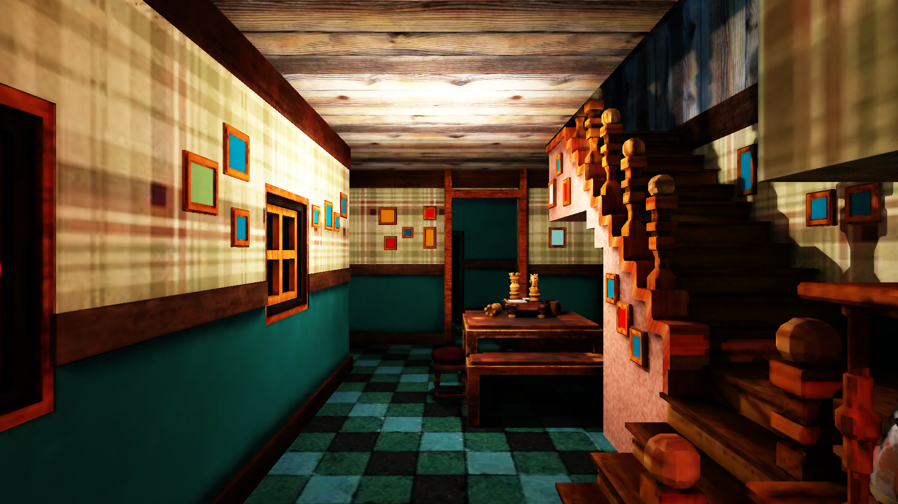
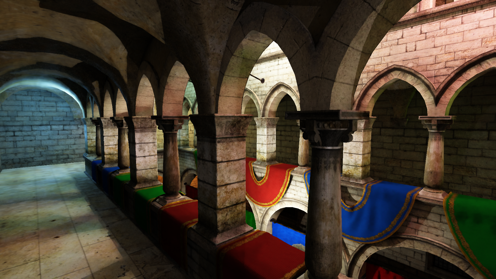

# Real-time ray tracing on WebGPU

## Preliminary

Please try this demo after upgrading your Chrome or Edge browser to the latest version.

For windows users with multiple graphic cards, please make sure you are using the high-performance graphic card.

## Installation

```cmd
yarn install

yarn host
```

To visit website on android phone, please connect your phone to the same network as your computer, and visit the ip address of your computer.

## Observation

- You may need to turn off direct lighting.
- Do not observe in scene "box". (There are only two lights)
- Turn on and turn off "RIS" to observe the difference.

For a better visual experience, please enable "denoise" and "super resolution" in the settings.
For low-end devices, please increase upscale ratio.

## Screen cut




